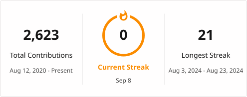

# Minda Huang

Student developer working on robotics, embedded systems, and computer vision.

  
  

  

## Selected Projects

- [**RMYC-yolo**](https://github.com/hs150521/RMYC-yolo) — Automatic aiming system developed for the RoboMaster Youth Championship (RMYC).
- [**Skin Disease Detector**](https://github.com/hs150521/skinDiseaseDetectorBackEnd) — CTB team project; responsible for model training and backend development.
- **Multiplexer Controller** — Qt and Modbus-based automated testing software developed during an internship.
- [**BreathSea**](https://github.com/hs150521/BreathSea) — Breath-responsive interactive artwork.

## Award-winning Hackathon Projects

- [**爱搞机鸭**](https://gallery.adventure-x.cn/projects/cms0k6bhe001p02jvziv4v67b) — Desktop AI companion integrating physical sensing and digital agents. Embedded developer; second prize.
- [**Silent Speak**](https://gallery.adventure-x.cn/projects/2500d2b4-87f2-43a3-89fa-a14aa05e9ea9?event=advx-2025) — Lip-reading communication prototype for AR glasses. Embedded systems and networking; second prize.

## Experience

- Lead programmer and competition engineer with [FRC Team 6941 IronPulse](https://github.com/frc6941).
- Programming mentor for [FTC Team 30319 LithiumPulse](https://github.com/frc6941/2026-ftc-robot).

  

